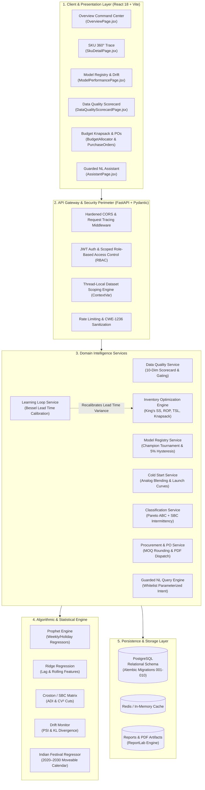
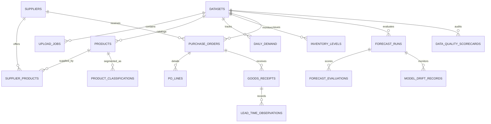

# Demand & Decision Intelligence System
## Comprehensive System Architecture: High-Level (HLD) & Low-Level (LLD) Specification

---

## 1. Executive System Overview

The **Demand & Decision Intelligence System** is an enterprise-grade, closed-loop supply chain planning and execution operating system designed specifically for modern omni-channel retail, quick-commerce, and multi-city fulfillment operations.

Unlike traditional passive business intelligence dashboards that merely report historical sales, this platform operates as an **autonomous decision loop**:
1. **Ingests & Audits:** Continuously audits incoming raw sales transactions against a 10-dimension statistical quality gate.
2. **Forecasts with Competition:** Conducts automated chronological champion/challenger tournaments with a 5% hysteresis barrier to prevent model flapping.
3. **Segments & Policies:** Classifies SKUs into 9 ABC-XYZ operational policies using Syntetos-Boylan-Croston (SBC) intermittency metrics.
4. **Optimizes Inventory:** Solves multi-echelon stock levels using King's stochastic lead-time safety stock and fractional knapsack budget allocation.
5. **Executes & Learns:** Automatically generates MOQ-rounded Purchase Orders, enforces RBAC approval tiers, and continuously recalibrates supplier lead times upon goods receipt (The Learning Loop).

---

## 2. High-Level Design (HLD)

### 2.1 System Architecture Diagram



---

### 2.2 End-to-End Decision Flow

```mermaid
sequenceDiagram
    autonumber
    actor User as Inventory Planner
    participant UI as Frontend Command Center
    participant API as FastAPI Gateway
    participant DQ as Quality Gating Engine
    participant ModelReg as Champion/Challenger Registry
    participant Policy as Policy & Inventory Engine
    participant Procure as Procurement & PO Engine
    participant DB as PostgreSQL

    User->>UI: Uploads Raw CSV Demand / Sales
    UI->>API: POST /api/upload
    API->>DQ: Audit 10 Quality Dimensions
    alt Quality Score < 50.0
        DQ-->>API: Gate Failed: RESTRICTED_TO_HEURISTICS_ONLY
        API->>DB: Lock ML Models; Fallback to 7D/30D Moving Averages
    else Quality Score >= 50.0
        DQ-->>API: Gate Passed: ALL_MODELS_PERMITTED
        API->>ModelReg: Run Chronological Rolling Backtest
        ModelReg->>ModelReg: Apply 5% Hysteresis Margin & Naive Floor
        ModelReg->>DB: Promote Best Model to Champion
    end

    API->>Policy: Compute ABC-XYZ, LTD, King's Safety Stock & ROP
    Policy->>DB: Persist Reorder Point & Stockout Probabilities
    
    User->>UI: Requests Replenishment / Budget Allocation
    UI->>API: POST /api/inventory/allocate (Budget Knapsack)
    API->>Procure: Group by Supplier, Round to MOQ & Pack Size
    Procure->>DB: Generate Sequential Draft PO (PO-YYYY-NNNN)
    Procure-->>UI: Return Optimized PO with Stockout Cost Avoided
    
    User->>UI: Approves Purchase Order
    UI->>API: POST /api/procurement/purchase-orders/{id}/approve
    API->>DB: Update Status to ISSUED; Generate Signed PDF
```

---

## 3. Low-Level Design (LLD)

### 3.1 Relational Schema & Entity-Relationship Model



#### Core Database Tables
1. **`datasets`**: Multi-tenant isolation anchor (`id`, `name`, `status`, `date_min`, `date_max`, `row_count`).
2. **`products`**: SKU master (`product_id`, `product_name`, `l0_category`, `l1_category`, `unit_cost`, `is_provisional`).
3. **`daily_product_demand`**: Aggregated daily time-series (`dataset_id`, `product_id`, `city_name`, `date_`, `total_quantity`).
4. **`forecast_runs` & `forecast_evaluations`**: Model tournament records (`is_champion`, `promoted_at`, `wape`, `rmse`, `mape`).
5. **`model_drift_records`**: Population Stability Index (`psi_score`), KL divergence, rolling WAPE drift, and `retrain_flagged`.
6. **`data_quality_scorecards`**: 10-dimension breakdown (`composite_score`, `quality_gate_passed`, JSON diagnostics).
7. **`suppliers` & `supplier_products`**: Procurement parameters (`moq`, `order_multiple`, `promised_lead_time_days`, `is_preferred`).
8. **`purchase_orders` & `po_lines`**: Formal execution records (`po_number`, `status`, `total_value`, `approval_tier`).
9. **`lead_time_observations`**: The Learning Loop delivery tracking (`promised_days`, `actual_days`, `variance`).
10. **`product_classifications`**: ABC-XYZ 9-cell segmentation (`annual_value`, `cv2`, `adi`, `sbc_class`, `review_policy`).
11. **`calendar_events`**: 2020–2030 moveable Indian festive regressors (`event_name`, `event_date`, `impact_window_before`, `impact_window_after`).

---

### 3.2 Mathematical & Algorithmic Engines

#### A. Data Quality Scorecard & Hard Gating (Prompt 5.9)
Evaluates 10 weighted dimensions on a 0–100 scale:
$$\text{Score} = S_{\text{comp}}(20) + S_{\text{gaps}}(15) + S_{\text{valid}}(15) + S_{\text{uniq}}(10) + S_{\text{outlier}}(10) + S_{\text{sku}}(10) + S_{\text{type}}(5) + S_{\text{zero}}(5) + S_{\text{depth}}(5) + S_{\text{fresh}}(5)$$

* **Quality Gating Floor:**
  $$\text{Gate Passed} = \begin{cases} \text{True (ALL\_MODELS\_PERMITTED)}, & \text{if } \text{Score} \ge 50.0 \\ \text{False (RESTRICTED\_TO\_HEURISTICS\_ONLY)}, & \text{if } \text{Score} < 50.0 \end{cases}$$

#### B. Anti-Shuffling Chronological Backtesting & 5% Hysteresis (Prompt 5.7)
* **Anti-Shuffling Assertion:** Requires strictly monotonic ordering $t_0 \le t_1 \le \dots \le t_n$. Raises `ValueError` upon non-chronological shuffling.
* **Weighted Absolute Percentage Error (WAPE):**
  $$\text{WAPE} = \frac{\sum_{t=1}^H |y_t - \hat{y}_t|}{\sum_{t=1}^H y_t} \times 100\%$$
* **5% Hysteresis Hurdle:** A challenger model $M_{\text{challenger}}$ can ONLY dethrone the incumbent champion $M_{\text{champion}}$ if:
  $$\text{WAPE}_{\text{challenger}} < \text{WAPE}_{\text{champion}} \times (1 - 0.05)$$
* **Naive Seasonal Floor:** No model is promoted if $\text{WAPE} \ge \text{WAPE}_{\text{naive}}$. SKUs failing this are marked `is_unforecastable = True`.
* **Data Drift (Population Stability Index - PSI):**
  $$\text{PSI} = \sum_{b=1}^B (P_b - Q_b) \times \ln\left(\frac{P_b}{Q_b}\right)$$
  Where $P_b$ is production demand share and $Q_b$ is training demand share across quantile bins. $\text{PSI} > 0.25$ triggers automated retrain flags.

#### C. Cold Start for New Products (Prompt 5.8)
For SKUs with $N < 30$ historical observations:
1. **Analog Matching:** Matches peer SKUs on $\text{Category} = \text{Target}$, $\text{Price} \in [0.7 P_{\text{target}}, 1.3 P_{\text{target}}]$, and same fulfillment city.
2. **Normalized Shape Averaging:** Normalizes analogs to their mean: $\hat{s}_i(t) = y_i(t) / \bar{y}_i$.
3. **Linear Decay Blending:**
   $$w_{\text{analog}} = \max\left(0.0, 1.0 - \frac{N}{60}\right), \quad w_{\text{sku}} = 1.0 - w_{\text{analog}}$$
   $$\hat{y}_{\text{blended}}(t) = w_{\text{analog}} \hat{y}_{\text{analog}}(t) + w_{\text{sku}} \hat{y}_{\text{sku}}(t)$$
4. **Uncertainty Expansion:** Prediction interval width is widened by $1.75\times$ whenever $w_{\text{analog}} > 0.3$.
5. **Synthetic Launch Curves:**
   * **Fast Ramp (Exponential):** $y(t) = P_{\text{max}} (1 - e^{-k t})$
   * **Slow Build (Logistic Sigmoid):** $y(t) = \frac{P_{\text{max}}}{1 + e^{-k(t - t_0)}}$
   * **Seasonal Spike (Gaussian):** $y(t) = P_{\text{max}} e^{-\frac{(t - t_{\text{spike}})^2}{2 \sigma^2}}$

#### D. ABC-XYZ Segmentation & Syntetos-Boylan-Croston (Prompt 4.7)
* **Average Demand Interval (ADI):** Average inter-arrival time between non-zero demand days.
* **Coefficient of Variation Squared ($CV^2$):** $(\sigma_d / \bar{d})^2$.
* **Classification Cutoff:**
  * $ADI < 1.32, CV^2 < 0.49 \implies$ **Smooth** (Continuous review, 98% service level)
  * $ADI \ge 1.32, CV^2 < 0.49 \implies$ **Intermittent** (Croston method, buffer stock)
  * $ADI < 1.32, CV^2 \ge 0.49 \implies$ **Erratic** (High safety stock, manual sign-off)
  * $ADI \ge 1.32, CV^2 \ge 0.49 \implies$ **Lumpy** (Periodic review, minimum stock)

#### E. Stochastic Inventory Optimization Arithmetic (Prompt 4.1 & 5.4)
* **Lead Time Demand (LTD):**
  $$\text{LTD} = \bar{d} \times \bar{L}$$
* **King's Formula Safety Stock (stochastic lead time + stochastic demand):**
  $$\text{SS} = Z_{\alpha} \times \sqrt{\bar{L} \cdot \sigma_d^2 + \bar{d}^2 \cdot \sigma_L^2}$$
* **Reorder Point (ROP):**
  $$\text{ROP} = \text{LTD} + \text{SS}$$
* **Target Stock Level (TSL) with Review Period $R$:**
  $$\text{TSL} = \bar{d} \times (\bar{L} + R) + \text{SS}$$
* **MOQ & Pack Size Rounding:**
  $$\text{PO\_Quantity} = \max\left(\text{MOQ}, \left\lceil \frac{\text{Net Demand}}{\text{Pack Size}} \right\rceil \times \text{Pack Size}\right)$$

#### F. Budget Allocation Knapsack (Prompt 4.6)
Ranks SKUs below ROP by Benefit-to-Cost ratio:
$$\text{Ratio}_i = \frac{\mathbb{P}(\text{stockout within horizon})_i \times \text{Expected Lost Units}_i \times \text{Margin}_i}{\text{Cost to bring SKU to TSL}_i}$$
Fills budget greedily with branch-and-bound integer refinement respecting MOQ constraints.

#### G. Bulk Forward-Buy Economic Order Model (Prompt 4.3)
Optimal forward-buy duration under anticipated price hike $\Delta P / P$ with holding cost $h$:
$$D^* = \frac{\Delta P}{P} \times \frac{365}{h}, \quad Q^* = \bar{d} \times D^*$$
Constrained by physical warehouse volume ($Q_{\text{storage}}$), working capital ($Q_{\text{capital}}$), and shelf life ($Q_{\text{shelf}} = 0.8 \times \text{shelf\_days} \times \bar{d}$).

---

### 3.3 Security, Multi-Tenancy & Hardening

1. **Multi-Tenant Dataset Scoping:**
   - Managed via Python `ContextVar` (`current_dataset_id`).
   - Every service layer query automatically injects `.filter(Model.dataset_id == target_dataset.id)` preventing cross-tenant leakage.
2. **Zero-SQL Injection Natural Language Layer (`/api/assistant/query`):**
   - Free-form LLM SQL execution is completely disabled.
   - Pydantic regex intent parser maps questions to a strict whitelist of 5 analytical query templates.
3. **CSV Formula Injection Defense (CWE-1236):**
   - `exportCsv.js` neutralizes dangerous cell prefixes (`=`, `+`, `-`, `@`, `\t`, `\r`) with a leading single quote before client-side file generation.
4. **RBAC & Approval Tiers:**
   - `viewer` (read-only), `manager` (approvals up to ₹500,000), `admin` (unlimited approvals, dataset lifecycle, system settings).

---

## 4. Summary of Verification & Test Coverage

* **Total Test Cases:** **117 passing automated unit and integration tests** across 18 test suites.
* **Execution Latency:** Complete test suite executes in **37.33 seconds** on Python 3.13.
* **Frontend Production Artifact:** `npm run build` completes in **853ms** with zero errors or unresolved dependencies.
